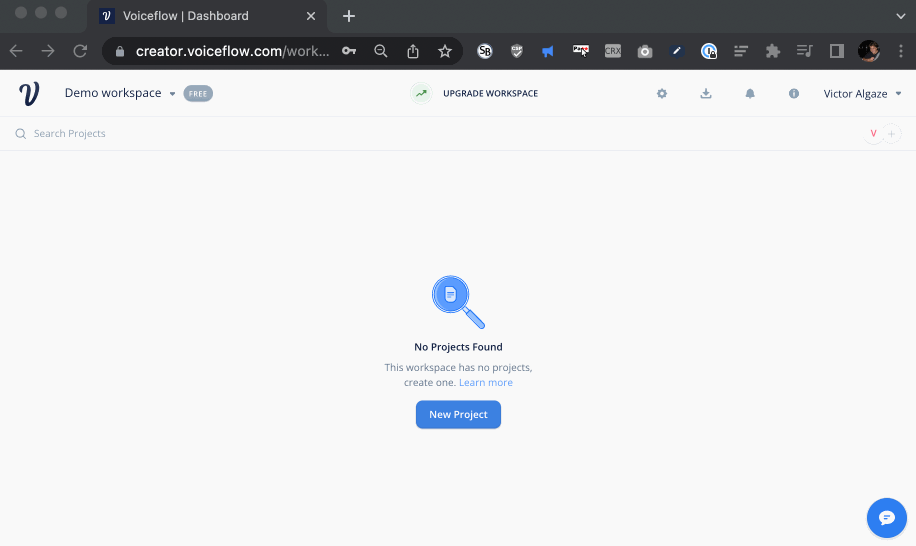
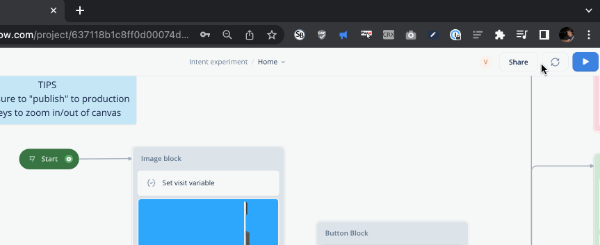
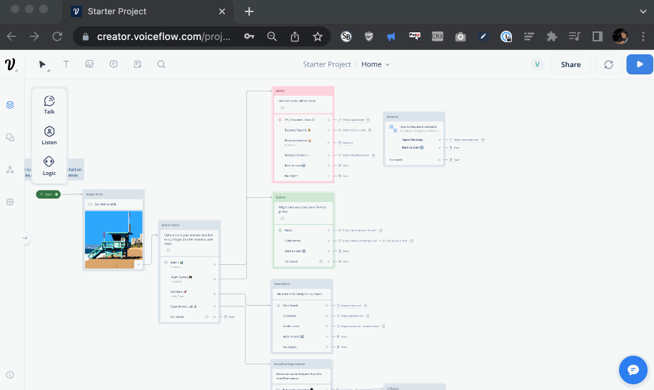
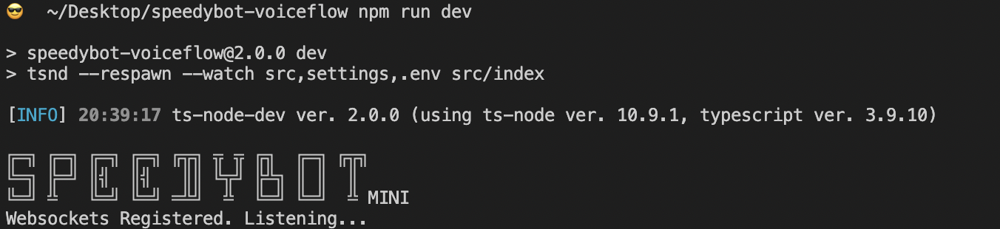
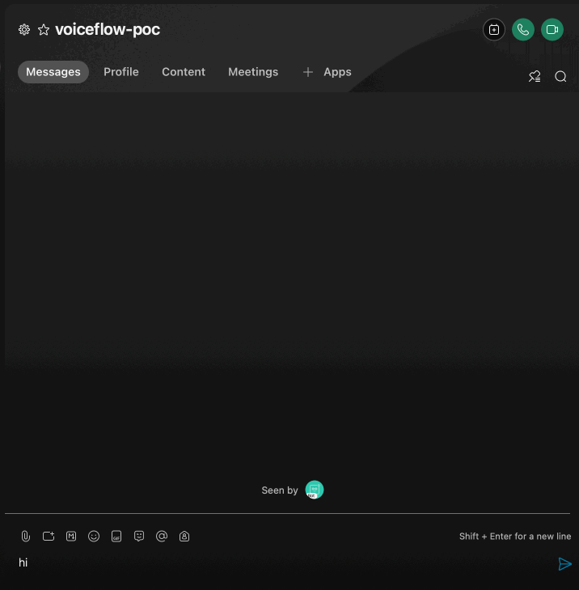
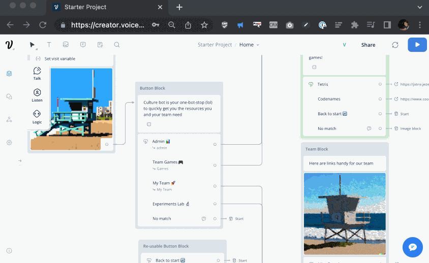
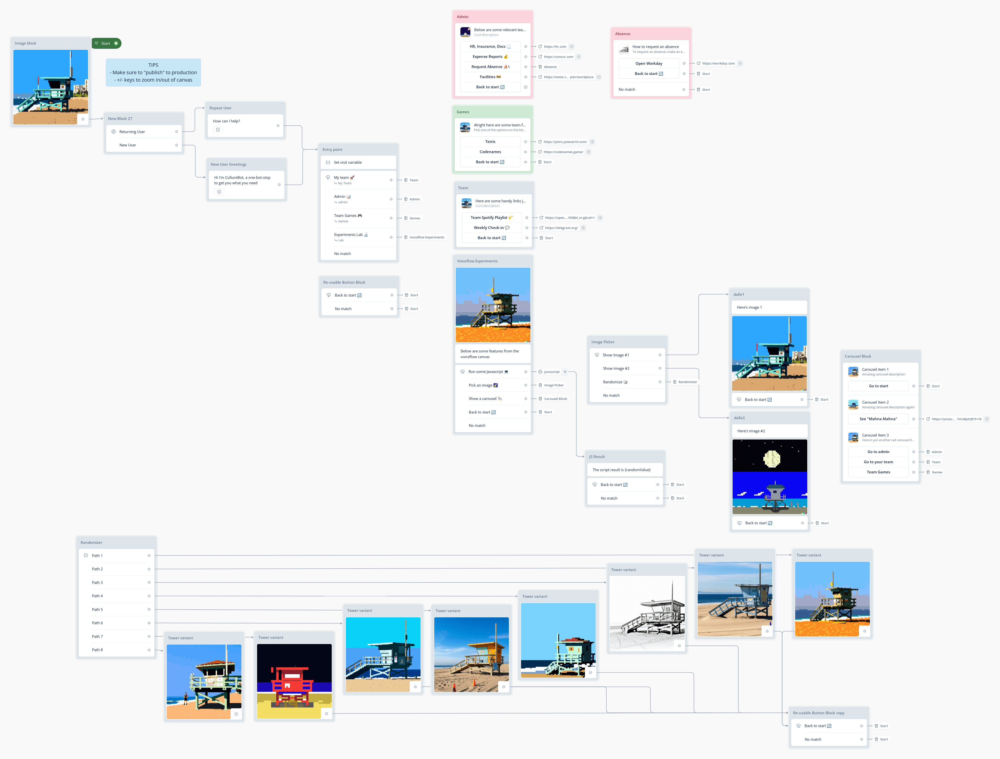

## Speedybot-voiceflow

This repo holds the project file and source code for the CultureBot conversational agent. CultureBot is a friendly and simple agent that will provide its host team efficient and speedy access to their most commonly used internal resources/tools.

CultureBot designed to be extended-- it's a barebones foundation upon which to build. Its natural language understanding and content is powered by **[Voiceflow](https://www.voiceflow.com/)** conversation design tooling. CultureBot supports rich components like buttons, cards, carousels, suggestion "chips", urls, etc

## "Conversation Design"

The days of manually writing keyword handlers or matching text with RegEx's are quickly coming to a close-- users need to be able to communicate with agents in natural language. Additionally agents need to have great content designed by people who are guided by real-world usage and research. This repo serves as a first proof of concept of how to build complex, user-valuable agents where the "content" is separated from code.

Follow the steps below to quickly get your own CultureBot up and running

## Quickstart

## 1) Clone repo & install dependencies

```
git clone https://github.com/valgaze/speedybot-voiceflow
cd speedybot-voiceflow
npm install
```

## 2) Set your bot access token

- Make a new bot and note its access token from here: **[https://developer.webex.com/my-apps/new/bot](https://developer.webex.com/my-apps/new/bot)**

- Copy the file **[.env.example](.env.example)** as `.env` in the root of your project and save your access token under the `BOT_TOKEN` field, ex

```
BOT_TOKEN=__REPLACE__ME__
```

## 3) Create an agent in Voiceflow

- If you don't have a Voiceflow account, create one here: **[https://creator.voiceflow.com/signup
  ](https://creator.voiceflow.com/signup)** and login

- From your Voiceflow dashboard, find the import button in the top right corner and import the **[project file (settings/culturebot.vf)](./settings/culturebot.vf)** to get up and running quickly-- you should see a project that looks something like this



## 4) "Publish" your Voiceflow agent

- Tap the "Publish" button in the top right corner



**Important:** If you make a change in Voiceflow, press publish to make those updates available to your agent

## 5) Grab your Voiceflow API Key

- On your way out of Voiceflow, tap the Voiceflow integrations button from the sidebar and copy the API key



- Save the key under the `VOICEFLOW_KEY` field in **[.env](.env.example)** from earlier, when you're finished it should look something like this:

```
BOT_TOKEN=NmFjNODY3MTgtNWIx_PF84_1eb65fdfm1Gak5PRFkzTVRndE5XSXhfUEY4NF8xZWI2NWZkZi05NjQzLTQxN2YtOTk3
VOICEFLOW_KEY=VF.DM.12345cbc8ef.sjaPjTtrgn
```

## 6) Boot it up!

- Start up your agent

Note: By default your agent will communicate using webhooks agent you won't need to worry about details like deployment or webhooks. Later down the line if you need to deploy your agent on a server or serverless function **[see here](https://github.com/valgaze/speedybot-mini/tree/deploy/examples/#examples)**

```
npm run dev
```



- Send your agent a direct message (username will be something like `botname@webex.bot`)



## 7) Build your agent

- From here you can make content changes in Voiceflow (make sure to hit **[publish](#4-publish-your-voiceflow-agent)**) without having to update/deploy code

- Your agent code mostly will forward to the NLU, however, you can do special work when a user sends a file (ex. do something when the user sends a spreadsheet) or call other services-- **[see here](https://github.com/valgaze/speedybot-mini/blob/deploy/api-docs/classes/BotInst.md#methods)** and **[here](https://github.com/valgaze/speedybot-mini/blob/deploy/api-docs/classes/Speedybot.md#onfile)** for details

- After changing the static content in the agent, you might want to start building new features that process natural language. You can change the agent's natural language behavior (intents) by tapping the NLU button at the top of the screen



## Deployment

This repo uses websockets to communicate with your agent without having to worry about infrastructure or registering webhooks. However, there may be circumstances where you would need to deploy your agent as a publically-accessible service like Lambda, traditional server, deno, etc, if that's the case, see the **[examples available here](https://github.com/valgaze/speedybot-mini/tree/deploy/examples/#examples)**

## Commands

| **Command**     | **Desciption**                                                                        |
| --------------- | ------------------------------------------------------------------------------------- |
| `npm start`     | Start chat agent (websockets)                                                         |
| `npm run dev`   | Start with live-reload on code-changes                                                |
| `npm run reset` | Run this if encounter websocket issue about "User has excessive device registrations" |

## Agent

[

](./docs/assets/agent.png)
