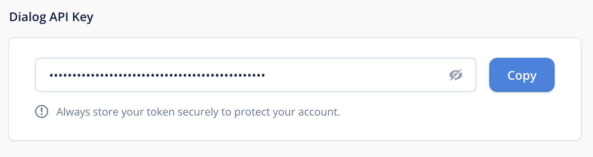

## Speedybot-voiceflow

## Quickstart

## 1) WebEx token

- If you don't have a bot, create one and save the token from here: **[https://developer.webex.com/my-apps/new/bot](https://developer.webex.com/my-apps/new/bot)**

- Set WebEx token in **[settings/config.json](./settings/config.json)** under the ```token``` field

## 2) Voiceflow Canvas api key

- From your project tap the Voiceflow icon in the top right corner select **Project Settings** >> **Integrations**

- Set VoiceFlow api key in **[settings/voiceflow.json](./settings/voiceflow.json)** under the ```apiKey``` field



## 3) Upload the Voiceflow project

- To get up and running quickly you can you can use the **[settings/icecream_shop.vf](./settings/icecream_shop.vf)** file as a starter project

- From your voiceflow dashboard, find the import button in the top right corner and select your project file 

## 3) Boot

```
npm run dev

# yarn run dev
```

## Video Instructions

- 101: https://share.descript.com/view/ds3UA1kUb9z

## Commands

| **Command** | **Desc** |
| --- | --- |
| ```npm run setup``` | Setup dependencies |
| ```npm run dev``` | Start with live-reload on code-changes |
| ```npm run ui``` | Boot web-based debug panel | 
| ```npm start``` | Start chat agent |
| ```npm start:server``` | Start server (you'll need to set ```webhookUrl``` in settings/config.json) |

## Demo

### Project


### Agent


<details>

<summary>todo</summary>

```
## todo

- docs

    - quickstart

    - *.vf file, instructions to import

    - docs where to find canvas api key, save to settings/voiceflow.json

- agent

    - say no when asking for more ice cream at "end"

```

</details>